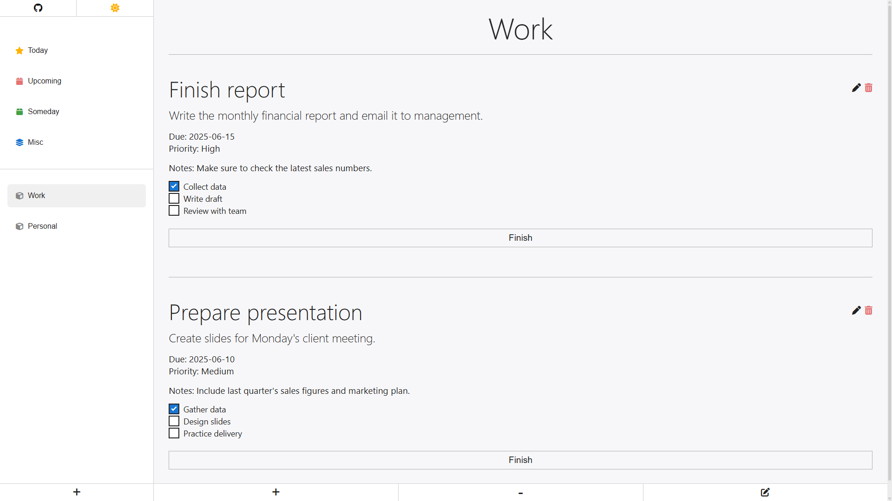

# The Odin Project - Full Stack JavaScript

## #6 Project: Todo List

Made with Webpack, HTML, CSS, JS.

This was an interesting project. It probably got bigger or more complex than it had to, but as usual, I wanted to make something that felt useful. Due to its amount of lines of code and having different modules through the app, Webpack made a lot more difference than on the previous project (Restaurant Page). It would auto import things, update paths, not to mention the prod optimization to improve performance once deployed. Simply a joy to work with.

